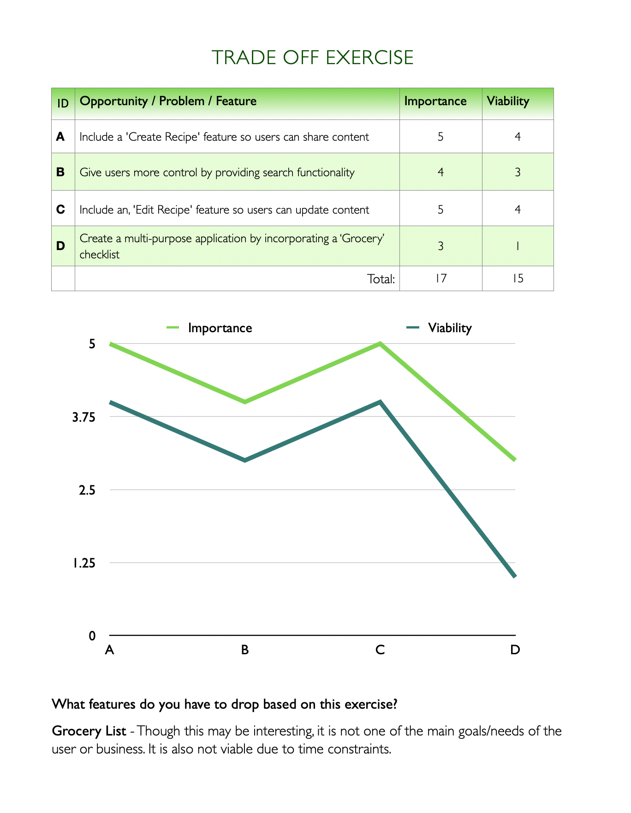

# Dash

Dash is a recipe crowdsourcing application for men & women, (ages 24 - 39), who want to find and share recipes.

## UX

As the Milestone 3 Project for [Code Institute's](https://codeinstitute.net/) Data Centric Development portion of the Full Stack Developer Program, this project was built with HTML, CSS, JavaScript, jQuery, Python, Flask and MongoDB.

Dash's target market is comprised of men & women, ages 24 - 39, that wish to find and share recipes with eachother.

User stories were created by the developer during the Strategy Plane phase of this milestone project to guide the wireframing process:

User Story 1:

> *"As a daily Dash user, I want to search for recipes, so that I can find recipes quickly"*
>> -Jane Marino, Homemaker

User Story 2:

> *"As a new user, I want to find the 'Sign Up' page right away, so I can create and update recipes."*
>> -Michael Corona, Yoga Teacher

User Story 3:

> *"As a user, I want to be able to post my own recipes, so I can share them with like-minded individuals."*
>> -Danielle Greenstein, Food Blogger

User Story 4:

> *"As a member, I want to be able to edit any of the reipes on the page, so I can use my expertise to contribute to the Dash community."*
>> -Andy Fordane, Chef

User Story 5:

> *"As a Dash member, I want other members to edit my recipes, so I can learn new ways to prepare dishes."*
>> -Danielle Greenstein, Food Blogger

The user story worksheet that was completed during the Strategy Plane portion of this project can be viewed here:

To determine what features were the most important and most viable, the following Strategy Plane activity was completed during the planning phase of this project:

To view a PDF version of this exercise, please refer to [this document](wireframes/tradeoff.pdf)

 The following wireframes were created by the developer to guide the development proess:

To make for a more organized development process, the developer used [GitHub Projects](https://github.com/users/alissatroiano/projects/4) to manage sprints and tasks. 

## Features

### Existing Features

In order to properly develop this full-stack application, the following features were included:

- Sign Up - allows users to create an account, by inputting an original username and a password.

- Log In - Allows users to login to their Dash account, by inputting the correct user and password keys.

- Create Recipe - Permits users to share original content to the Dash community, by granting them write access to the database and having them fill out a form.

- Edit Recipe - Allows users to edit any recipe, by including a functional, 'Edit' button with each recipe.

- Search - Allows users to search for specific recipes, by providing them with a searchbar that fetches and displays relevant data.

### Features Left to Implement

- A 'Grocery List' page - Allows users to create grocery lists, by having them create a checklist and manage/update it accordingly.

## Technologies Used

- [HTML](https://html.com/)

- This project uses HTML to display and format content on the front-end.

- [CSS](https://www.w3.org/Style/CSS/Overview.en.html)

- This project uses **CSS** to add styles and responsiveness to its' content.

- [Python](https://www.python.org/)

- This project uses **Python** to speed up development time and integrate systems.

- [PIP](https://pypi.org)

- This project uses **Pip** to install software dependencies for Python.

- [Flask](https://flask.palletsprojects.com/en/1.1.x/)

- This project uses the **Flask** framework to reduce development time and build a more robust application.

- [Jinja](https://jinja.palletsprojects.com/en/2.11.x/)

- This project uses the **Jinja** templating functionality to create HTML that is returned to the user via HTTP requests.

- [MongoDB](https://www.mongodb.com/)

- This project uses **MongoDB** to simplify data storage and manipulation.

- [PyMongo](https://pypi.org/project/pymongo/)

- This project uses the driver **PyMongo** to interact with MongoDB from Python.

- [Git](https://git-scm.com/)

- This project uses **Git** for code storage and version control.

- [GitHub](https://github.com/)

- This project uses **GitHub** for version control and project management.

- [Materialize](https://materializecss.com/)

- This project used **Materialize** to add styles and improve user experience.

## Testing

Thorough testing was conducted by the developer for this project and can be viewed in [TESTING.md](TESTING.md)

## Deployment

This section should describe the process you went through to deploy the project to a hosting platform (e.g. GitHub Pages or Heroku).

In particular, you should provide all details of the differences between the deployed version and the development version, if any, including:

- Different values for environment variables (Heroku Config Vars)?
- Different configuration files?
- Separate git branch?

In addition, if it is not obvious, you should also describe how to run your code locally.

## Credits

### Development Process

- The steps taken to properly configure Flask and MongoDB were learned by following [Code Institute's](https://codeinstitute.net/) 'Data Centric Development: Flask Mini Project' lesson.

- The steps taken to import the favicon into the head element of the base html page were copied from (Stack Overflow)(https://stackoverflow.com/questions/11893478/add-favicon-to-website) and [Hostinger](https://www.hostinger.com/tutorials/how-to-add-favicon-to-website).

- The developer made use of [GitHub Projects](https://github.com/users/alissatroiano/projects/4) to manage development and set sprints in an efficient manner.

- The **cycle method** used to create different columns and rows on the recipes landing page was learned by reading the Tips and Tricks portion of [Jinja's documentaton](https://jinja.palletsprojects.com/en/2.11.x/tricks/).

- The media queries defined in the stylesheet for tablets and large devices were copied/learned from [W3 Schools](https://www.w3schools.com/css/css_rwd_mediaqueries.asp).

### Content

- The grid layout and responsive design were made possible by importing [Materialize](https://materializecss.com/) front-end framework and using the built-in classes.

- The 'Cauliflower Grilled Cheese' recipe was copied from [delish](https://www.delish.com/cooking/recipe-ideas/g3733/healthy-dinner-recipes/).

- Text shadow styles were copied from [CSS Tricks](https://css-tricks.com/almanac/properties/t/text-shadow/).

### Media

- Dash's favicon was copied from [Openclipart.org](https://openclipart.org/detail/321362/kitchen-utensils) and is licensed under Creative Commons.

- The default photo that is selected when a user does not upload an image was copied from [unsplash](https://unsplash.com/photos/fnztlIb52gU).

- The icon in the branded navigation menu, responsive sidebar and footer was copied from [Font Awesome](http://fontawesome.com/)

- The footer styles were copied from [Materialize]() and altered via copying [W3 Schools](https://www.w3schools.com/howto/howto_css_fixed_footer.asp).

- The stock images used to create the recipes were copied from:

    - Cauliflower Grilled Cheese; [Unsplash](https://unsplash.com/photos/SqYmTDQYMjo)

    - Tomato Chicken Garlic [Unsplash](https://unsplash.com/photos/9WfO94SjhmE)

    - Broccoli Quinoa Cakes - [Feasting at Home](https://www.feastingathome.com/broccoli-cakes/)

    - [ifoodreal.com](https://ifoodreal.com/clean-eating-recipes-dinners/)

### Acknowledgements

- I received markdown instructions from this [Markdown Cheatsheet](https://github.com/adam-p/markdown-here/wiki/Markdown-Cheatsheet#blockquotes)

- I received UX inspiration from [Awwwards](https://www.awwwards.com)

- I received UX inspiration from [Behance](https://www.behance.net)

- I learned about Flask file upload configurations from [Flask's Documentation](https://flask-uploads.readthedocs.io/en/latest/).