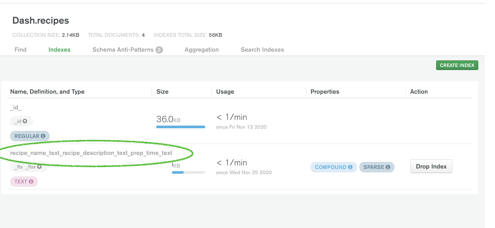

# Testing

The following tests have been conducted by the developer. Each test described below was accompanied by the actions taken to ensure the tests passed.

## Navigation

### Navbar Test #1:
- Visit app in web browser.
- Observe navigation bar.
- Click on each link.
- Verify each link directs user to intended template.
- Repeat steps 1-4 on tablet.
- Declare test 'passed'.

### Mobile Side Navbar Test:
- Visit app in mobile web browser.
- Click on 'fas fa-bars' icon.
- Verify sidenav opens properly.
- Declare test 'passed'.

### Navbar Changing State Test:
- Visit app in web browser.
- Oberserve navbar links read, 'Recipes', 'Signup' and 'Login'.
- **Sign In** to the database.
- Observe changes in navbar links once user is signed in.
- Verify navbar links read, 'Recipes', 'Add Recipe', 'Profile', and, 'Logout' while user is logged in.
- **Log Out** of the application.
- Verify navbar links return to original state (Recipes', 'Signup' and 'Login') once user is logged out.
- Declare test, 'passed'.

## Search 

### Create Index Test 1:
- Visit GitPod worspace
- Type `python3` to activate the Python interpreter
- Type, `from app import mongo` to import mongoDB
- Create the Search Index
- Verify the following text printed after creating the index, `recipe_name_text_recipe_description_text_prep_time_text`
- Declare Test, 'passed'.

### Create Index Test 2:
- Visit [MongoDB Cloud Atlas](https://cloud.mongodb.com/)
- Visit the, 'Dash' database that was created for this application.
- Click on the, 'recipes' collection.
- Visit the, 'Indexes' tab.
- Verify that the newly created index appears on the page.
- Declare test, 'passed'.

### Search Index Test 1:
