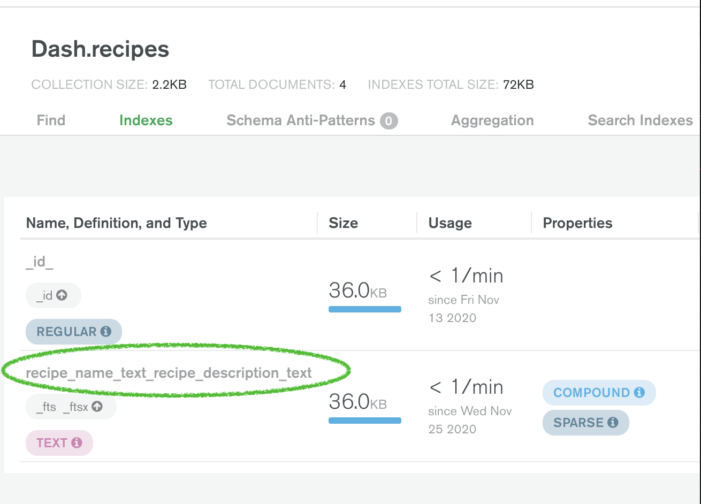
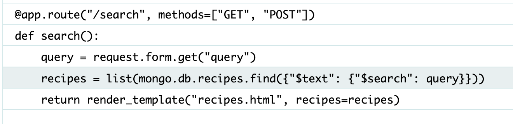

# Testing
The following tests have been conducted by the developer. The tests were accompanied by the steps outlined below to ensure each test passed.

## Navigation

### Navbar Test #1:
- Visit the app in web browser.
- Visit the navigation menu.
- Click on each link that is currently displayed.
- Verify each link directs the user to the correct HTML template:
    - Login
    - Signup
    - Home
- Repeat steps 1-4 on mobile.
- Repeat steps 1-4 on tablet.
- Declare test 'passed'.

### Navbar Test #2 - `target=_blank`
- Visit the app in workspace while reading through the `Code Institute Student Pre-Submission Checklist`.
- Observe, `target=_blank` is not set for all `<a>` elements (as outlined in presubmission checklist).
- Visit the navigation menu in `base.html`.
- Add `target=_blank` to all `<a>` elements.
- Commit and push all code changes.
- Reload web browser.
- Observe that links now open in a new tab to satisfy grading criteria.
- Declare test 'passed'.

### Materialize Side Navigation Test #1:
- Visit the app in web browser.
- Resize browser tab to make, `fas fa-bars` icon visible.
- Click the `fas fa-bars` icon.
- Observe that the side nav is not opening on click.
- Navigate to `static/js/script.js`.
- Ispect the jQuery code.
- Observe that jQuery is formatted correctly.
- Vist `base.html`.
- Scroll to the section containing **scripts**.
- Observe the following incorrect script src:
``
-  Fix the script so it reads:
``
- Save code and push to GitHub.
- Reload browser and repeat steps 1-3.
- Observe that the side nav now opens correctly.
- Ensure each link works (by clicking each link).
- Declare test 'passed'.

### Materialize Mobile Side Navigation Test #2:
- Visit the app in mobile web browser.
- Click on 'fas fa-bars' icon.
- Verify side nav opens properly.
- Declare test 'passed'.

### Navbar State Change Browser Test:
- Visit the app in web browser.
- Observe navbar links read, 'Recipes', 'Signup' and 'Login'.
- **[Login](https://dash-ms3.herokuapp.com/login)**.
- Observe state change in navbar once a user is logged in.
- Verify navbar links read, 'Home', 'Add Recipe', 'Profile', and, 'Logout' while a user is logged in.
- **Log Out** of the application.
- Verify navbar links return to the original state (Home', 'Signup', and 'Login') once a user is logged out.
- Declare test, 'passed'.

### Navbar State Change Mobile Test:
- Visit the app on a mobile web browser.
- Observe navbar links ('Home', 'Signup' and 'Login').
- **[Login](https://dash-ms3.herokuapp.com/login)**.
- Observe changes in navbar links once a user is signed in.
- Verify navbar reads, 'Home', 'Add Recipe', 'Profile', and, 'Logout' while a user is logged in.
- **Log Out** of the application.
- Verify navbar links return to the original state (Home', 'Signup', and 'Login') once a user is logged out.
- Declare test, 'passed'.

## Signup 

### Signup - Frontend Test:
- Visit the app in a web browser.
- Click, [Signup](https://dash-ms3.herokuapp.com/signup).
- Enter a new username.
- Enter a new password. 
- Submit the form.
- Observe, 'success!' flash message.
- Confirm HTML is rendering properly on the frontend.
- Declare test, 'passed'.

### Signup Form - POST Request Test:
- Visit app in web browser.
- Click, [Signup](https://dash-ms3.herokuapp.com/signup).
- Enter a new username and password.
- Click `submit`.
- Observe, 'success!' flash message displays and confirm success on the frontend.
- Navigate to **MongoDB** recipes database.
- Click on the `users` collection.
- Ensure a new record has been created.
- Inspect the document and verify the username in the DB matches the username created in step 3.
- Confirm that the `signup` function in `app.py` is properly wired to MongoDB.
- Declare test, 'passed'. 

## Login

### Login Browser Test:
- Visit app in a web browser.
- Click, [Login](https://dash-ms3.herokuapp.com/login).
- Enter the previously created username.
- Enter the previously created password. 
- Ensure the existing user can log in successfully. 
- Declare test, 'passed'.

### Login Test 2:
- Visit the app in web browser.
- Click, [Login](https://dash-ms3.herokuapp.com/login).
- Enter the previously created username.
- Enter an incorrect password. 
- Ensure the existing user is unable to login with invalid credentials. 
- Declare test, 'passed'.

### Login Test 3:
- Visit app in web browser.
- Click, [Login](https://dash-ms3.herokuapp.com/login).
- Enter a username.
- Enter the password with incorrect text-cases. 
- Ensure the password is case-sensitive.
- Log out.
- Visit `Login` again.
- Enter the correct username and correct password.
- Log in to the application successfully.
- Repeat these steps on mobile and tablet.
- Declare test, 'passed'.

## Search 

### 'Search' - Index Test 1:
- Visit GitPod workspace
- Type `python3` to activate the Python interpreter
- Type, `from app import mongo` to connect to MongoDB
- Create the Search Index
- Verify the following text printed after creating the index, `recipe_name_text_recipe_description_text`
- Declare Test, 'passed'.

### 'Search' - Index Test 2:
- Visit [MongoDB Cloud Atlas](https://cloud.mongodb.com/)
- Visit the 'Dash' database that was created for this application.
- Click on the 'recipes' collection.
- Visit the 'Indexes' tab.
- Verify that the newly created index appears on the page.
- Declare test, 'passed'.

### 'Search' - Case Insensitive Test #1:
- Open the deployed project in a web browser.
- Visit the search form.
- Enter the word, 'tomato' in all lowercase letters in the search bar.
- Ensure that all recipes containing the word, 'tomato' in the name and/or description are displayed.
- Repeat the above steps, but with all capital letters.
- Repeat the above steps, using a mixture of lowercase and uppercase letters.
- Verify that all relevant recipes display in search results regardless of letter case.
- Declare test, 'passed'.

### Search - Case Insensitive Test #2:
- Open the deployed project in my mobile web browser.
- Visit the search form.
- Enter the word, 'chicken' in all lowercase letters in the search bar.
- Ensure that all recipes including the word, 'chicken' in the name and/or description are displayed.
- Repeat the above steps, but with all capital letters.
- Repeat the above steps, using a mixture of lowercase and uppercase letters.
- Verify that all relevant recipes display in search results.
- Declare test, 'passed'.

### 'Reset' Button Test #1:
- Open the deployed project in a web browser.
- Visit the search bar.
- Enter the word, "GitHub" to ensure no results are generated.
- Click on the, 'Reset' button.
- Verify that search resets.
- Declare test, 'passed'.

### 'Reset' Button Test #2:
- Open the deployed project in a mobile browser.
- Visit the search bar.
- Enter the word, "GitHub" to ensure no results are generated.
- Click on the, 'Reset' button.
- Verify that search resets.
- Declare test, 'passed'.

### 'Search' - Query Test:
- Visit the project in browser during mentor session.
- Demonstrate newly added search functionality to mentor.
- Discuss search function with mentor.
- Decide to refactor `search` function, using the HTTP 'GET' method.
- Refactor function in, `app.py`.
- Update `templates/recipes.html` with `method="GET"`.
- Save code.
- Run the application.
- Notice a PyMongo error, reading:
`pymongo.errors.OperationFailure: "$search" had the wrong type.`
- Inspect the error log.
- Discover the problem:

### 'Search' - Query Test **Solution**:
- Visit `app.py` and scroll to line 46 to inspect the search function.
- Discuss the problem with my mentor.
- Scroll to line 45, `query = request.form.get("query")`. 
- Conclude that 'form' must be replaced with, **args** because **request.args** is used to return values of a query string.
- Edit line 45 to read, `query = request.args.get("query")`.
- Hard reload the live preview.
- Notice the error log no longer generates.
- Observe rendered HTML. 
- Open the console and ensure there are no errors.
- Conclude that the PyMongo $search error has been repaired.
- Visit the search form to continue tests.

### Updated 'Search' Function Tests:
- Open the app in Chrome browser.
- Test search function by querying the word, 'tomato'.
- Ensure the query remains in search form after form submission.
- Ensure query stays in search form after results have been fetched. 
- Click on recipe activator to reveal content.
- Ensure query stays in search form while a user interacts with content.
- Declare test, 'passed'.

### 'Search' Button Test #1:
- Open the deployed project in a mobile browser.
- Visit the search bar.
- Enter the word, "chicken" to ensure the recipe result is generated.
- Click on the, 'Search' button.
- Verify search form returns recipes that include, 'chicken' in the name or description.
- Enter 5 unique queries to prove search form returns results that contain the query phrase in their title or description.
- Declare test, 'passed'.

### Add Recipe W3C Test 1:
- Copy all of `add_recipe.html`
- Paste code in [W3C HTML Validator](https://validator.w3.org/)
- Observe **textarea** errors, `Attribute type not allowed on element textarea at this point.`.
- Open workspace.
- Delete `type="text"` from all textareas.
- Copy contents of `add_recipe.html` and paste in W3C html validator.
- Ensure all textarea related errors are no longer present.
- Declare test, 'passed'.

### Add Recipe Mobile Test:
- Open the deployed project in a mobile web browser.
- Login to the application.
- Visit the 'Add Recipe' page.
- Fill out the input form with an image uploaded from the iPhone photo library.
- Submit the form.
- Observe that a Jinja, error log renders after clicking, `submit.`
- Review the contents of the error report. 
- Diagnose the problem: Line 123, `app.py` (`add_recipe` function).
- Visit the workspace and scroll down to line 123.
- Inspect the `recipe` dictionary that is sent to MongoDB upon creating a new recipe.
- Scroll to the `edit_recipe` function and notice conflicting key-value pairs. 
 - Rename and repair.
- Push all changes to GitHub.
- Reload web browser and repeat steps 4-5.
- Observe flash notification, `Recipe successfully added.`
- Declare test, `passed`.

## File Upload Tests

### Mobile File Upload Test #1:
- Open the deployed project in a mobile web browser.
- Login to the application.
- Visit, 'Add Recipe' page.
- Fill out the input form with an image uploaded from the iPhone photo library.
- Submit the form.
- Visit the `Recipes` landing page.
- Observe images uploaded from mobile do not render after submission.
- Open Chrome Developer Tools and inspect the failed image uploads.
- Notice the request type reads, `text/HTML`. 
- Add the `accept` attribute with value `image/*` to file input.
- Reload the page to see if the problem persists.
- Open Dev Tools.
- Observe all mobile uploaded images are now rendering as, `image/jpeg`, `image/png`, etc.
- Declare test, 'passed'.

## W3C Testing

### W3C Jigsaw CSS Test:
- Visit W3C Jigsaw Validator.
- Copy `style.css` and paste via 'direct upload'.
- Observe one `Parse Error`
- Open the stylesheet and scroll to the line of code where the error is.
- Notice the second closing `}` is not present in the media query.
- Add the closing bracket.
- Test CSS again via direct upload.
- Observe that there are zero errors remaining.
- Declare test, 'passed'.

### W3C HTML Validator Tests:
- Visit [W3C HTML Validator](http://validator.w3.org/)
- Visit workspace.
- Navigate to /templates.
- Copy the entire contents of 'recipes.html' and paste into HTML validator.
- Inspect results.
- Repair all possible errors:
    - Mixed 
 tag: 
        - Scroll to line where error appeared. 
        - Add closing 

    - Missing <alt> tags:
        - Scroll to line 35:
        `  `
        - Attempt to repair alt tags by adding a default alt tag.
        - Reload browser and inspect.
        - Obseve all images now have the same alt tag.
        - Add the following alt tag:
          ``
        - Save code and reload page.
        - Inspect images using Chrome Dev Tools.
        - Observe that each image now has a unique alt tag (the recipe name).
- Repeat steps 1 - 5 for every .html file in /templates.
- Remove all errors (except those made by Jinja template inheritance).
- Declare test, 'passed'.
